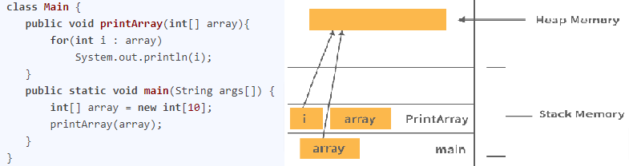

# Java Basic Interview Questions

### Q) What is Java?

  - Java is a high-level, object-oriented programming language.
  - It's built on the principles of object-oriented programming (OOP).
  - It can be used to develop large-scale applications.

### Q) Why is Java a platform-independent language?

  - Java doesn't depend on any specific hardware or software because the compiler converts the source code into platform-independent **bytecode**.
  - This bytecode can be run on any system that has a Java Runtime Environment (JRE) installed.
  - The JRE acts as an interpreter between the bytecode and the underlying operating system.

### Q) Why is Java not a pure object-oriented language?

Java isn't considered a "pure" object-oriented language because it supports **primitive data types** (like `int`, `char`, `boolean`, `double`, etc.), which are not objects.

### Q) What is the difference between Heap and Stack Memory in Java?

  - **Stack Memory**: This is a region of memory assigned to each thread when it's created. It's used for static memory allocation and stores primitive variables and references to objects. Memory is managed in a Last-In-First-Out (LIFO) order and is fixed in size.
  - **Heap Memory**: This is a larger memory pool shared among all threads in a Java application. It's used for dynamic memory allocation, where all objects and JRE classes are stored.  
    

**How Java Utilizes This Memory:**

  - When a Java program starts, all its variables and method calls are stored in the **stack memory**.
  - When you use the `new` keyword to create an object, the object itself is created in the **heap memory**, while a reference to that object is stored in the **stack memory**.

### Q) Is Java a completely object-oriented programming language?

No, as mentioned before, Java is not a pure OOP language because it allows the direct use of primitive data types, which are not objects.

### Q) How is Java different from C++?

  - **Execution**: C++ is only a compiled language, creating platform-specific machine code. Java is both compiled (to bytecode) and interpreted (by the JVM), which allows for platform independence.
  - **Pointers**: C++ allows direct memory manipulation through pointers. Java does not allow explicit pointers, which enhances security and simplicity. Java uses pointers internally, but they are not accessible to the programmer.
  - **Multiple Inheritance**: C++ supports multiple inheritance, where a class can inherit from more than one parent class. Java does not support multiple inheritance for classes to avoid the "Diamond Problem" (ambiguity that can arise from it), but it achieves a similar result using interfaces.

### Q) Pointers are used in C/C++. Why does Java not use pointers?

  - **Simplicity**: Pointers can be complex and are a common source of errors, especially for beginners. Java's design prioritizes code simplicity and readability.
  - **Security**: Pointers allow direct access to memory locations, which can be a significant security risk. By abstracting away pointers, Java provides a more secure environment and prevents unauthorized memory access.

### Q) What do you understand by an instance variable and a local variable?

  - **Instance Variables**: These are variables declared inside a class but outside any method, constructor, or block. They belong to an instance of the class (an object) and are accessible by all methods within that class.
  - **Local Variables**: These are variables declared inside a method, constructor, or block. Their scope is limited to that specific block, and they can only be accessed within it.  
  

### Q) What are the default values assigned to variables and instances in Java?

  - **Local Variables**: There are **no default values** assigned to local variables. You must initialize them before use, or you will get a compilation error.
  - **Instance Variables**: When an object is created, its instance variables are automatically initialized with default values by the constructor if they are not explicitly assigned a value. The default value depends on the data type.

### Q) What do you mean by data encapsulation?

  - Data Encapsulation is an OOP concept where you bundle the data (attributes) and the methods (behaviors) that operate on the data into a single unit, called a class.
  - It promotes **modularity**, as each object is a self-contained unit.
  - It is a key mechanism for achieving **data hiding**, where the internal state of an object is protected from outside access. This is typically done by making variables `private` and providing `public` getter and setter methods to access them.

-----

### Q) What is the difference between the `equals()` method and the equality operator (`==`) in Java?

The primary difference is that `==` is an operator used for reference comparison (checking if two references point to the same memory location), while `equals()` is a method used for content comparison (checking if two objects have the same value).

| `==` Operator                                | `equals()` Method                               |
| -------------------------------------------- | ----------------------------------------------- |
| Compares the memory address of two objects.  | Compares the content or value of two objects.   |
| It is an operator.                           | It is a method.                                 |
| Can be used with primitive types.            | Cannot be used with primitive types.            |
| Cannot be overridden.                        | Can be overridden.                              |

The default implementation of the `equals()` method in the `Object` class simply uses the `==` operator. However, classes like `String` and `Integer` override it to perform a content-based comparison.

-----

### Q) Explain the concept of constructor overloading.

Constructor overloading is the practice of having multiple constructors within a single class, each with a different parameter list. They all share the same name (the class name), but they must differ in the **number**, **type**, or **order** of their parameters. This allows you to create objects in different ways.

-----

### Q) Define Copy Constructor in Java.

A copy constructor is a special constructor that initializes a new object using the values from an existing object of the same class. It takes an object of the same class as an argument and copies the data from the passed-in object to the new object being created.

-----

### Q) Can the `main` method be overloaded?

**Yes**, the `main` method can be overloaded just like any other method in Java. You can have multiple methods named `main` as long as their parameter lists are different. However, the JVM will only ever call the specific `main` method that has the signature `public static void main(String[] args)`.

-----

### Q) What is the difference between method overloading and overriding?

  - **Method Overloading (Compile-time Polymorphism)**: This occurs when two or more methods within the **same class** have the same name but different parameters (in number, type, or order). It's a way to enhance program readability. The correct method to call is decided at compile time.
  - **Method Overriding (Run-time Polymorphism)**: This occurs when a subclass (child class) has a method with the **same name, parameters, and return type** as a method in its superclass (parent class). The version of the method that gets executed is determined at runtime based on the object type.

| Method Overloading                               | Method Overriding                               |
| ------------------------------------------------ | ----------------------------------------------- |
| Occurs within the same class.                    | Occurs in two classes with an inheritance relationship. |
| Parameters must be different.                    | Parameters must be the same.                    |
| Return type can be different.                    | Return type must be the same or covariant.      |
| An example of compile-time polymorphism.         | An example of run-time polymorphism.            |

-----

### Q) Explain the use of the `final` keyword in a variable, method, and class.

  - **`final` variable**: When a variable is declared as `final`, its value cannot be modified once assigned. It effectively becomes a **constant**. If a `final` variable isn't initialized at declaration, it must be initialized in the constructor.
  - **`final` method**: A method declared as `final` **cannot be overridden** by any subclass. This is used to prevent its behavior from being changed.
  - **`final` class**: A class declared as `final` **cannot be inherited** or extended by any other class. For example, the `String` class in Java is `final`.

-----

### Q) What is the `finalize()` method?

The `finalize()` method is a protected method of the `java.lang.Object` class. The garbage collector calls this method on an object just before it is destroyed and its memory is reclaimed. It's used to perform cleanup activities, such as closing files or releasing system resources. However, its use is generally discouraged as there's no guarantee when or if it will be called.

-----

### Q) Is it possible that the `finally` block will not be executed?

Yes, there are a few situations where a `finally` block might not be executed:

  - If you call `System.exit()` from within the `try` or `catch` block, the JVM shuts down before the `finally` block can run.
  - If a fatal, unrecoverable error occurs, like a `StackOverflowError` or an `OutOfMemoryError`, which causes the JVM to crash.
  - If the thread executing the code is killed or interrupted.

-----

### Q) When can you use the `super` keyword?

The `super` keyword is a reference variable used to refer to the immediate parent class object. You can use it in the following scenarios:

  - To access **data members** (fields) of the parent class when both the parent and child class have a member with the same name.
  - To call the **default or parameterized constructor** of the parent class from the child class's constructor. This must be the first statement in the child constructor.
  - To call a **parent class method** from a child class, especially when the child class has overridden that method.

-----

### Q) Can static methods be overloaded?

**Yes**, static methods can be overloaded just like instance methods. You can have multiple static methods with the same name in a class, as long as they have different parameter lists.

-----

### Q) Why is the `main` method static in Java?

The `main` method is declared `static` so that the JVM can call it **without creating an instance** of the class. Since the `main` method is the entry point of any Java application, an object of the class does not exist before it is run. `static` members belong to the class itself, not to any specific object, allowing the JVM to call `main` directly using the class name.

-----

### Q) Can static methods be overridden?

**No**, static methods cannot be overridden in the same way that instance methods can. While you can declare a static method with the same signature in a subclass, this is known as **method hiding**, not overriding. The method that gets called is determined at compile time based on the reference type, not at runtime based on the object type (which is the essence of overriding).

-----

### Q) What is the difference between static methods, static variables, and static classes in Java?

  - **Static Variables and Methods**: These members belong to the **class itself**, not to any individual instance (object) of the class. They are loaded into memory when the class is loaded. You can access them directly using the class name (e.g., `Math.max()`).
  - **Static Class**: A class can only be declared as `static` if it is a **nested class** (a class within another class). A static nested class behaves like any other top-level class and can be instantiated without an instance of the outer class. It can only access static members of the outer class.

-----

### Q) What is the main objective of garbage collection?

  - The primary goal of garbage collection is to **automatically manage memory** by freeing up space occupied by objects that are no longer in use by the program.
  - It deletes "unreachable" objects from the heap memory, helping to prevent memory leaks and ensuring more efficient use of memory.

-----

### Q) What is a ClassLoader?

A `ClassLoader` is a part of the Java Runtime Environment (JRE) responsible for dynamically loading Java classes into the JVM at runtime. When a program needs a class that hasn't been loaded yet (e.g., you create a `new Scanner()`), the ClassLoader finds the corresponding `.class` file and loads its bytecode into memory.

-----

### Q) What is a Shallow Copy?

In a shallow copy, a new object is created, but the fields of the original object are copied over directly. If a field is a primitive type, its value is copied. If a field is a reference to another object, only the **reference (memory address) is copied**, not the object itself.

```java
// Example of a shallow copy (reference copy)
Rectangle obj1 = new Rectangle();
Rectangle obj2 = obj1; // obj2 now points to the same object as obj1
```

This means both `obj1` and `obj2` point to the *same* object in memory. If you change the state of the object through `obj2`, the change will be reflected when you access it through `obj1`.

-----

### Q) What is a Deep Copy?

In a deep copy, a new object is created, and the fields of the original object are copied over. If a field is a reference to another object, a **new copy of that object is also created**.

```java
// Example of a deep copy (manual)
Rectangle obj1 = new Rectangle();
Rectangle obj3 = new Rectangle();
obj3.length = obj1.length;
obj3.breadth = obj1.breadth;
```

This ensures that the original object and the copy are completely independent. Changes made to one will not affect the other. The `clone()` method, when properly implemented, can be used to perform a deep copy.
